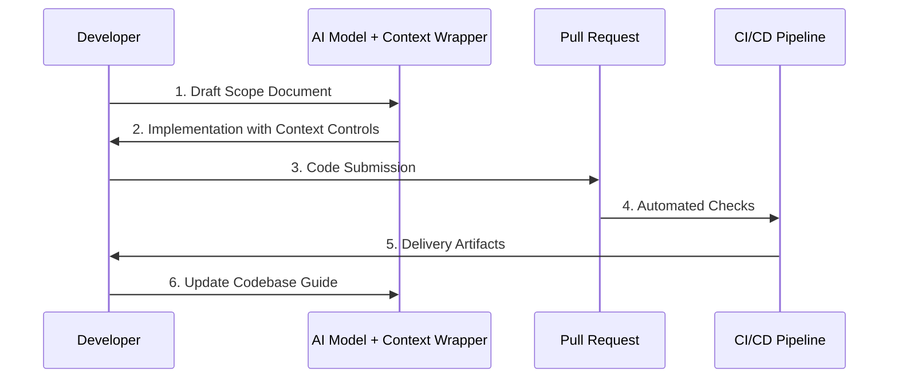

# **AI Delivery Framework**

_A professional method for AI-assisted software delivery._

---

## Elevator Pitch

The AI Delivery Framework repository provides a living, version-controlled governance system for shipping AI-enabled software at professional scale.
It codifies a body of knowledge—expressed through Codebase Guides, scoped evolution plans, and tier-based context wrappers—that lets teams move at AI speed without compromising engineering discipline, compliance, or auditability.


---

## Core Governance Components

| Component | Purpose | Location |
|-----------|---------|----------|
| **Codebase Guide** | Live reference for the "as-is" system. | [`codebase_guide.md`](codebase_guide.md) |
| **Scope Document** | Defines the "to-be" functionality for each version. | [`meta/scope_doc_template.md`](meta/scope_doc_template.md) |
| **Context Wrapper** | Applies delivery rules based on Delivery Tier. | [`meta/context_wrappers/`](meta/context_wrappers/) |

---

## Quickstart



1. **Clone / Fork** the repository
2. **Select a Delivery Tier** from the [delivery tiers guide](docs/delivery_tiers.md)
3. **Draft a Scope Document** for your first version
4. **Generate Code** using the Context Wrapper for your tier
5. **Commit, Test, and Ship** via the prescribed workflow

_For detailed guidance see [`docs/00_index.md`](docs/00_index.md)._

---

<details>
<summary><strong>Operating Principles</strong> (click to expand)</summary>

1. **Scope Before Code** – every change begins with a versioned scope document.
2. **Modular & Testable** – AI-generated code must be small, composable, and covered by tests.
3. **Environment Discipline** – Docker-based dev environments and CI/CD from day one.
4. **Adaptive Rigor** – delivery standards scale through **Delivery Tiers**.
5. **Tool & Model Agnostic** – compatible with any AI model or tech stack.
6. **Compliance When Required** – bolt-on modules (GDPR, HIPAA, etc.) only when the project stage demands.
</details>

---

<details>
<summary><strong>Delivery Workflow (High Level)</strong> (click to expand)</summary>

1. **Project Initialisation** – assess risk and set Delivery Tier.
2. **Scoping** – write or update the versioned scope document.
3. **Model & Tool Selection** – choose LLMs and dev tools that fit the tier.
4. **Prompt Structuring** – decompose work into modular, testable prompts.
5. **Implementation & Testing** – code + tests generated via AI within the governed context.
6. **Review & Merge** – human review reinforced by automated checks.
7. **Continuous Delivery** – CI/CD pipeline ships artefacts appropriate to the tier.
8. **Governance Update** – update Codebase Guide and plan next scope.
</details>

---

<details>
<summary><strong>Compliance Integration</strong> (click to expand)</summary>

The framework keeps compliance _modular_:

- **GDPR Lite** is required from **Tier 2** if personal data is processed.
- Additional modules (GDPR Full, HIPAA, SOC2, PCI-DSS) are integrated _only_ when legally or contractually required.
- Internal security guidelines inherit from company policy at Tier 3 and above.

This staged model protects early-stage agility while guaranteeing auditability for production systems.
</details>

---

<details>
<summary><strong>Repository Map</strong> (click to expand)</summary>

```text
/ai-delivery-framework/
├── README.md
├── LICENSE
├── CONTRIBUTING.md
├── CODE_OF_CONDUCT.md
├── codebase_guide.md
├── roadmap.md
├── meta/
│   ├── delivery_tiers.md
│   ├── full_workflow.md
│   ├── model_strategy.md
│   ├── codebase_guide_template.md
│   ├── scope_doc_template.md
│   └── context_wrappers/
│       ├── tier0_exploration_context_wrapper.md
│       ├── tier1_hobby_context_wrapper.md
│       ├── tier2_mvp_context_wrapper.md
│       ├── tier3_beta_context_wrapper.md
│       ├── tier4_production_context_wrapper.md
│       └── tier5_enterprise_context_wrapper.md
├── tools/
│   ├── current_tooling_landscape.md
│   └── recommended_tool_criteria.md
├── examples/
│   └── flowerpot_booking_form/
├── docs/
│   ├── 00_index.md
│   ├── delivery_tiers.md
│   ├── introduction.md
│   ├── theory_of_operation.md
│   ├── shipping_plan.md
│   ├── architecture/
│   │   └── generate_c4_diagrams.py
│   └── appendices/
│       ├── faq.md
│       └── lessons_learned.md
├── assets/
│   ├── branding/
│   │   ├── logo.png
│   │   └── brand_sheet.pdf
│   └── diagrams/
└── .github/
    └── workflows/
        └── markdown-check.yml
```
</details>

---

## Roadmap

See the detailed [roadmap](roadmap.md) for upcoming features and improvements.

---

## License

MIT License. See [`LICENSE`](LICENSE) for full terms.