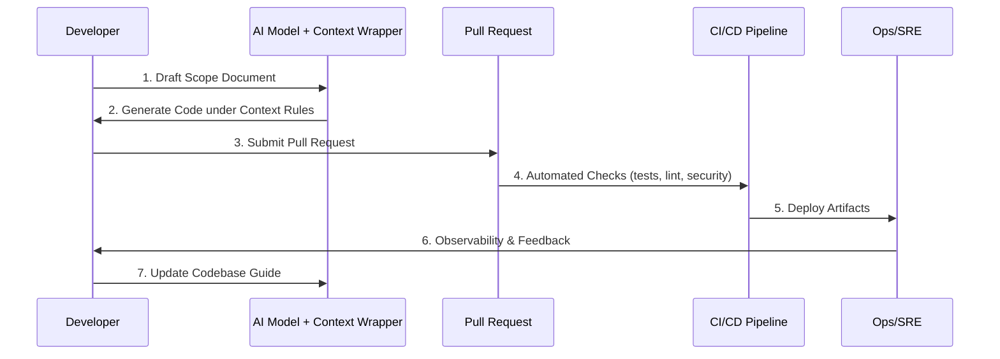

# AI Delivery Framework

> **Governance-first delivery system for AI-enabled software**

---

## Table of Contents

1. [Executive Summary](#1-executive-summary)
2. [The Governance Triangle](#2-the-governance-triangle)
3. [Delivery Tiers at a Glance](#3-delivery-tiers-at-a-glance)
4. [High-Level Workflow](#4-high-level-workflow)
5. [Quickstart](#5-quickstart)
6. [Repository Map](#6-repository-map)
7. [Documentation Index](#7-documentation-index)
8. [Contributing](#8-contributing)
9. [License](#9-license)

---

## 1. Executive Summary

The **AI Delivery Framework** is a living, version-controlled governance system that lets teams harness AI coding assistants **without sacrificing**:

* Engineering discipline
* Compliance & auditability
* Long-term maintainability

It achieves this by combining three integrated mechanisms—**Codebase Guide, Scope Documents, and Context Wrappers**—under a **progressive rigor model** known as *Delivery Tiers*.

> **Who is this for?** Engineering leaders, architects, and developers who need to scale AI-accelerated delivery while meeting professional standards.

---

## 2. The Governance Triangle

| Component | Role | Maintained By |
|-----------|------|--------------|
| **Codebase Guide** | Canonical "as-is" description of the system | Engineers after each merge |
| **Scope Documents** | "To-be" plan for each version, including acceptance criteria | Product & Engineering before work starts |
| **Context Wrappers** | Tier-specific rules injected into AI tools & CI/CD | Prompt layer + automation |

Together these assets form a **closed-loop control system** that keeps AI-generated code aligned with business goals and compliance requirements.

---

## 3. Delivery Tiers at a Glance

| Tier | Typical Use | Key Engineering Gates |
|------|-------------|-----------------------|
| **0 – Exploration** | Chat-only experimentation | None |
| **1 – Prototype** | Internal spikes | Minimal checks |
| **2 – MVP** | Early user validation | Tests + GDPR Lite* |
| **3 – Beta** | Public pilot | Full test suite + secure coding review |
| **4 – Production** | Launched product | CI/CD, SRE readiness, compliance gates |
| **5 – Enterprise** | Regulated, high-security | Continuous compliance, advanced audit |

\* GDPR Lite activates if personal data is processed.

---

## 4. High-Level Workflow

---

## 5. Quickstart

1. **Clone / Fork** the repository.
2. **Select** your [delivery tier](docs/delivery_tiers.md) based on project risk.
3. **Create** a Scope Document from [`core/scope_doc_template.md`](core/scope_doc_template.md).
4. **Develop** using the Context Wrapper for your tier (`core/context_wrappers/`).
5. **Run** CI/CD and ship. Update the Codebase Guide on merge.

---

## 6. Repository Map

| Path | Purpose |
|------|---------|
| `core/` | Governance core (codebase guide, scope template, context wrappers) |
| `docs/` | User & architecture documentation |
| `meta/` | Framework design notes & templates |
| `tools/` | Recommended tooling landscape |
| `.github/` | CI/CD workflows |

---

## 7. Documentation Index

| Topic | Entry Point |
|-------|-------------|
| Onboarding | [`docs/introduction.md`](docs/introduction.md) |
| Theory of Operation | [`docs/theory_of_operation.md`](docs/theory_of_operation.md) |
| Delivery Tiers | [`docs/delivery_tiers.md`](docs/delivery_tiers.md) |
| Roadmap | [`roadmap.md`](roadmap.md) |
| Contribution Guide | [`CONTRIBUTING.md`](CONTRIBUTING.md) |

---

## 8. Contributing

We welcome improvements that strengthen the framework's governance core. Please read the [Contribution Guide](CONTRIBUTING.md) and ensure all pull requests:

* Reference an approved Scope Document
* Update the Codebase Guide if structural changes occur
* Pass the relevant Context Wrapper checks for your tier

---

## 9. License

This project is licensed under the MIT License – see [`LICENSE`](LICENSE) for details.