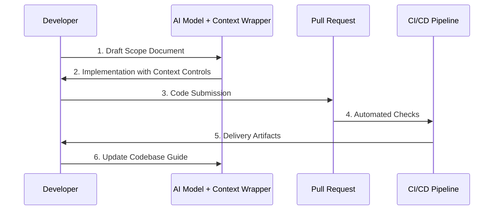

# AI Delivery Framework

> A living, version-controlled governance system for shipping AI-enabled software at professional scale.

## The Governance Triangle

The framework is built on three integrated components:

| Component | Purpose | Location |
|-----------|---------|----------|
| **Codebase Guide** | Documents the current "as-is" state | [`core/codebase_guide.md`](core/codebase_guide.md) |
| **Scope Documents** | Defines the "to-be" target state | [`core/scope_doc_template.md`](core/scope_doc_template.md) |
| **Context Wrappers** | Enforces delivery tier discipline | [`core/context_wrappers/`](core/context_wrappers/) |

## Quickstart

1. **Clone/Fork** the repository
2. **Select** your [delivery tier](docs/delivery_tiers.md) based on project risk
3. **Create** a scope document from the template
4. **Generate Code** using the appropriate context wrapper
5. **Ship** via the prescribed workflow

## Documentation

- [**Getting Started**](docs/introduction.md) - Detailed onboarding
- [**Theory of Operation**](docs/theory_of_operation.md) - Framework philosophy
- [**Delivery Tiers**](docs/delivery_tiers.md) - Progressive rigor model

## License

MIT License. See [`LICENSE`](LICENSE) for full terms.