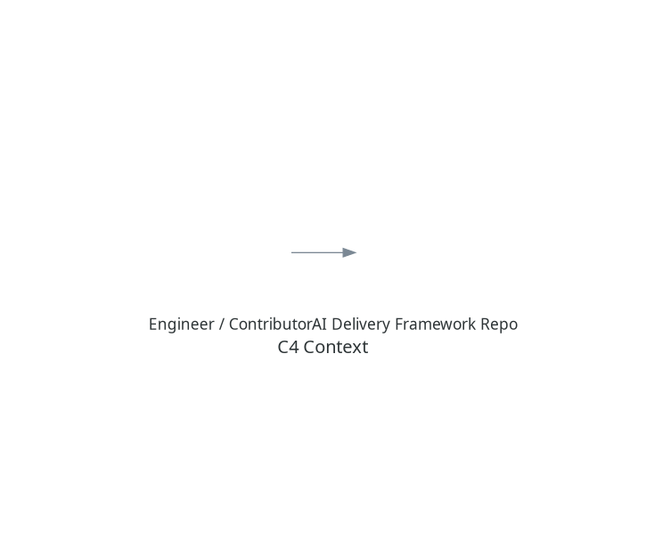
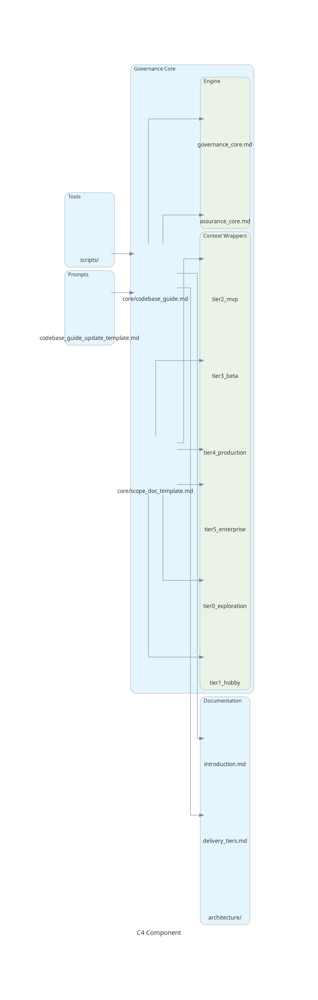

# Codebase Guide

*Generated: 2023-09-22*

---

## 1. Project Structure

| Directory / File | Purpose |
|------------------|---------|
| `README.md` | High-level overview of the AI Delivery Framework. |
| `meta/` | Governance core templates (`codebase_guide_template.md`, `scope_doc_template.md`) and context wrapper definitions. |
| `docs/` | Framework reference documentation. Holds introduction, theory of operation, and architecture diagrams. |
| `docs/appendices/` | Supporting documentation including FAQ and lessons learned. |
| `tools/` | Reference material on current AI tooling landscape and recommended criteria. |
| `examples/` | Sample projects demonstrating the framework (e.g. `flowerpot_booking_form/`). |
| `assets/branding/` | Logo and brand assets. |
| `assets/diagrams/` | Repository diagrams and visualizations. |
| `docs/architecture/` | C4 diagrams and generation script (`generate_c4_diagrams.py`). |
| `CONTRIBUTING.md` | Contribution guidelines. |
| `CODE_OF_CONDUCT.md` | Community behaviour standards. |
| `roadmap.md` | Planned framework evolution. |
| `.github/workflows/` | CI/CD pipeline configurations for automated checks. |

---

## 2. Key Modules & Components

| Path | Component | One-liner Description |
|------|-----------|-----------------------|
| `meta/codebase_guide_template.md` | Template | Skeleton for future codebase guides. |
| `meta/scope_doc_template.md` | Template | Versioned scope document template with acceptance criteria and traceability. |
| `meta/context_wrappers/` | Markdown Wrappers | Delivery-tier specific prompt wrappers that enforce engineering discipline. |
| `meta/governance_core.md` | Governance Doc | Explains the live governance loop: Codebase Guide, Scope Docs, and Context Wrappers. |
| `docs/00_index.md` | Documentation Index | Landing page for all framework documentation. |
| `docs/introduction.md` | Intro Doc | Detailed rationale and onboarding guidance for new engineers. |
| `docs/theory_of_operation.md` | Conceptual Doc | Explains the framework's genesis, philosophy and core mechanisms. |
| `docs/delivery_tiers.md` | Reference Doc | Detailed breakdown of the progressive rigor model across tiers. |
| `docs/architecture/generate_c4_diagrams.py` | Utility Script | Generates C4 Context, Container, and Component diagrams using the `diagrams` library. |

---

## 3. Data Flow

```
Contributor ➜ edits markdown / code
          ➜ commits & pushes to GitHub repository
          ➜ CI/CD pipeline validates Markdown quality
          ➜ CI/CD (external) generates artefacts and triggers docs/architecture script (optional)
          ➜ Updated documentation & diagrams stored in repo
```
*All artefacts are version-controlled; no runtime application code or persistence layer exists in this repository.*

---

## 4. Entry Points & Core Logic

| Entry Point | Location | Function |
|-------------|----------|----------|
| Diagram generation | `docs/architecture/generate_c4_diagrams.py` | Produces `c4_context.png`, `c4_container.png`, `c4_component.png`. Requires local Graphviz (`dot`) on PATH. |
| Context Wrappers | `meta/context_wrappers/*` | Read by external AI tooling to apply Delivery Tier rules. |
| Markdown Lint | `.github/workflows/markdown-check.yml` | Validates Markdown formatting and link integrity. |

There are **no executables, services, or CLIs** beyond these helper scripts.

---

## 5. Known Quirks / Tech Debt

1. **Graphviz Dependency** – The diagram script fails if `dot` is not installed (see current error stack in commit history).
2. **Manual Diagram Refresh** – Diagrams must be regenerated locally and committed; no automation yet.
3. **Documentation-Heavy Repo** – No code compilation or tests exist; future integration tests for context wrappers are desirable but absent.
4. **Markdown Linting** – Currently only checks for basic formatting; should expand to validate framework-specific conventions.

---

## 6. C4 Diagrams

| Level | Image |
|-------|--------|
| Context |  |
| Container |  |
| Component |  |

*Diagrams generated via `docs/architecture/generate_c4_diagrams.py`.* 

---

## 7. Update Process

The Codebase Guide should be regenerated whenever significant changes occur to the codebase structure, component relationships, or architectural patterns. This includes after completing a scope document's planned changes, merging major features, or refactoring that affects the system's organization. Engineers should update this guide as the final step in their delivery workflow, ensuring it remains the authoritative reference for the current state of the system.