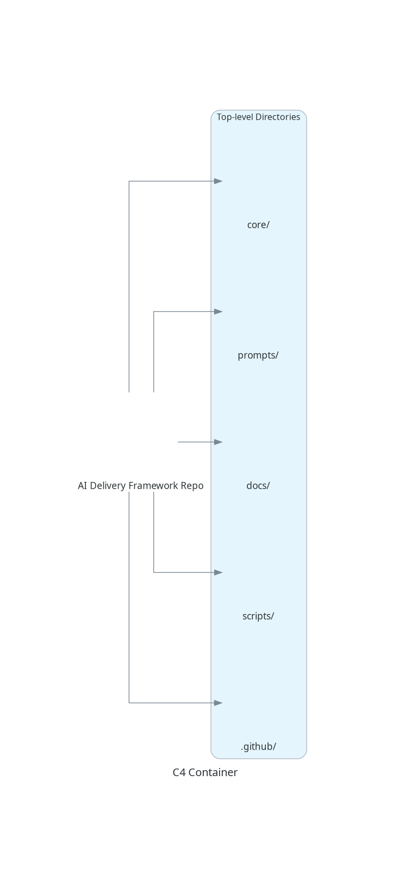

# Codebase Guide

*Generated: 2025-04-29*

This guide provides an authoritative description of the current codebase state.

## 1. Project Structure

| Directory | Purpose |
|-----------|---------|
| `core/` | Contains governance core components: codebase guide, scope template, context wrappers |
| `meta/` | Engine design documentation and templates |
| `docs/` | User-facing documentation and architecture diagrams |
| `tools/` | Tool recommendations and tooling landscape information |
| `scripts/` | Utility scripts for repository maintenance |
| `.github/` | CI/CD workflows and repository configuration |

## 2. Key Modules & Components

| Component | Purpose |
|-----------|---------|
| `core/codebase_guide.md` | Authoritative description of current codebase state |
| `core/scope_doc_template.md` | Template for creating versioned evolution plans |
| `core/context_wrappers/tier*` | Delivery tier-specific disciplinary controls (0-5) |
| `docs/introduction.md` | Engine onboarding documentation |
| `docs/delivery_tiers.md` | Progressive rigor model details |
| `docs/workflow.md` | Detailed workflow documentation |
| `docs/tools_comparison.md` | Comparison of available tools |
| `docs/when_you_can_change_scope_mid_workflow_and_when_you_cant.md` | Guidance on scope management |
| `docs/example_ai_coding_policy.md` | Template for ISO27001 and Cyber Essentials compliant AI coding policy |
| `docs/architecture/generate_c4_diagrams.py` | Script to generate architecture diagrams |
| `meta/governance_core.md` | Engine governance principles |
| `meta/assurance_core.md` | Assurance mechanisms documentation |
| `meta/OPEN_CHALLENGES.md` | Documentation of current challenges |
| `meta/codebase_guide_update_template.md` | Template for updating the codebase guide |
| `tools/recommended_tool_criteria.md` | Criteria for tool selection |
| `tools/current_tooling_landscape.md` | Overview of available AI tools |
| `scripts/consolidate_codebase.py` | Script to consolidate codebase into a single text file |
| `scripts/consolidated_codebase.txt` | Consolidated view of the entire codebase |

## 3. Data Flow

```
Contributor → Selects Delivery Tier → Uses Context Wrapper with AI →
            → Implements Code → Updates Codebase Guide → Consolidates Codebase
```

## 4. Entry Points & Core Logic

1. Begin with `docs/introduction.md` for engine overview
2. Select appropriate delivery tier from `core/context_wrappers/`
3. Use corresponding context wrapper with AI tools
4. Follow workflow described in `docs/workflow.md`
5. Update codebase guide after significant changes
6. Generate consolidated codebase view with `scripts/consolidate_codebase.py`

## 5. Known Quirks / Tech Debt

- Diagram generation requires manual execution of Python script
- No automated validation of context wrapper adherence
- Documentation structure needs more cross-linking between components
- Tools documentation is minimal and needs expansion

## 6. C4 Diagrams

### Context Diagram


### Container Diagram



### Component Diagram

