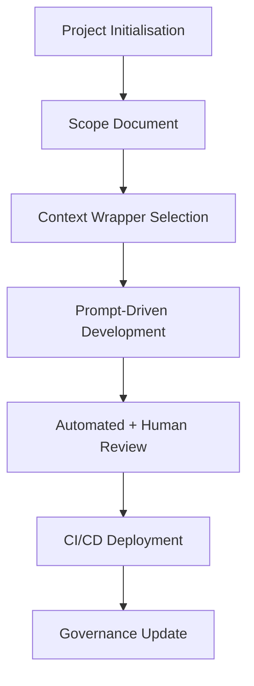

# Introduction

AI Delivery Framework is a governance-first approach to AI-assisted software delivery. This document covers why it exists, how it works, and when to use it.

---

## 1. Why the Framework Exists

Bolting an LLM onto a legacy process rarely works. Teams need AI speed without losing rigour, compliance, or maintainability.

The framework delivers that through:

* A **clear governance core** (Codebase Guide + Scope Docs + Context Wrappers).
* A **tiered maturity model** that lets standards grow with product risk.
* A **tool- and model-agnostic approach** so teams can adopt new AI capabilities rapidly.

---

## 2. Governance Core

| Asset | Role | Maintained By |
|-------|------|--------------|
| **Codebase Guide** | Canonical reference for the *current* system. | Engineers after each merge |
| **Versioned Scope Document** | Defines the *target* state for each release. | Product + Engineering before work starts |
| **Context Wrapper** | Enforces delivery discipline according to Delivery Tier. | Prompt layer & CI/CD hooks |

These three assets act as **living contracts** that keep AI-generated work auditable and aligned with business goals.

---

## 3. Delivery Tiers (Snapshot)

| Tier | Typical Use | Key Engineering Gates |
|------|-------------|-----------------------|
| 1 – Prototype | Internal spikes | Minimal checks |
| 2 – MVP | Early user validation | Tests + GDPR Lite* |
| 3 – Beta | Public pilot | Full test suite + secure coding review |
| 4 – Production | Launched product | CI/CD, SRE readiness, compliance gates |
| 5 – Enterprise | Regulated, high-security | Continuous compliance, advanced audit |

\* GDPR Lite applies if personal data is processed.

---

## 4. Target Audience

* **Engineering Teams** looking to boost velocity with AI while retaining discipline.
* **Start-ups** that need to scale standards progressively as they find product-market fit.
* **Enterprises** that must prove compliance and auditability when integrating LLM tooling.

---

## 5. Supported AI Tools

The framework is specifically designed for integration with AI-powered code editors including:

* **Cursor** - Uses the governance triangle to guide AI generation within established boundaries
* **Winsurf** - Leverages context wrappers to maintain discipline in AI-assisted development
* Other AI coding assistants that support custom context/rules injection

By providing structured governance through these tools, the framework keeps AI development on track while maximizing productivity benefits.

---

## 6. Workflow Overview

1. **Project Initialisation** – set risk profile and assign Delivery Tier.
2. **Scope Document** – capture the to-be state in a versioned markdown file.
3. **Context Wrapper** – load prompts that enforce tier-specific rules.
4. **Prompt-Driven Development** – generate modular code + tests via AI.
5. **Review & Deployment** – automated checks plus human approval; ship via CI/CD.
6. **Governance Update** – update Codebase Guide and plan the next iteration.

---

## 7. Compliance Philosophy

Compliance is **modular and progressive**:

* **Start minimal** – no premature heavyweight controls at Tier 1.
* **Add as needed** – GDPR Lite from Tier 2 when personal data appears.
* **Scale to full** – HIPAA, SOC2, PCI-DSS integrated only when required.

This balances early agility with the audit trail production demands.

---

## 8. Getting Started (Quick Steps)

1. **Clone / Fork** this repository.
2. **Read** the sample `meta/codebase_guide_template.md` and `meta/scope_doc_template.md`.
3. **Define** your Delivery Tier in `meta/delivery_tiers.md`.
4. **Draft** your first Scope Document (e.g. `v0.1.0.md`).
5. **Follow** the workflow described above, using the Context Wrapper for your tier.
6. **Commit** code and tests; update the Codebase Guide on merge.

---

## 9. Further Reading

| Topic | Document |
|-------|----------|
| Full Workflow | `docs/why_framework.md` |
| FAQ | `docs/faq.md` |
| Roadmap | `roadmap.md` |
| Lessons Learned | `docs/lessons_learned.md` |

---

## 10. Framework Evolution

AI Delivery Framework evolves through real projects. Key drivers:

* **Road testing** – validate across projects of increasing complexity.
* **Continuous refinement** – adjust patterns and governance as we learn.
* **Community insights** – fold practitioner feedback into standards.
* **New AI capabilities** – leverage advances without relaxing discipline.

Expect the framework to mature rapidly as more teams adopt it.

---

*Last updated: {{DATE}}*