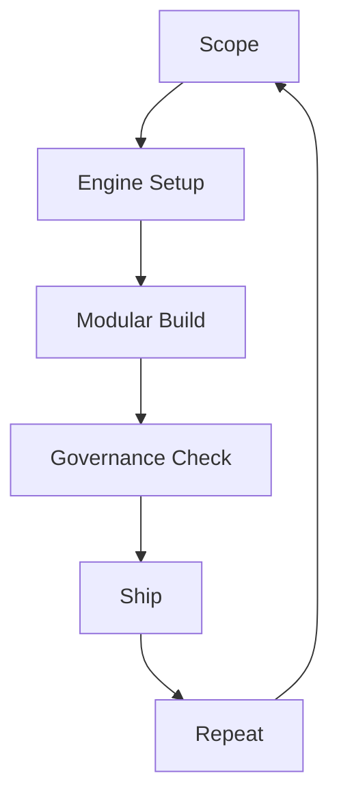

# Introduction

The AI Delivery Engine is a cohesive set of tools, standards, and feedback loops that lets you build software *fast* and *safely* with AI coding assistance. It enforces that **every stage—Scope, Setup, Build, Governance Check, Shipping, Repeat—occurs *inside* this mono-repo and your IDE workspace.** It lets developers tap AI coding speed without giving up traceability, security, or quality.

### Quick Summary

- **Velocity with Governance** — Ship faster while meeting security, compliance, and audit demands.
- **Binary Assurance** — A Governance Core *defines*, an Assurance Core *verifies*; no grey areas, only pass/fail.
- **Tiered Rigor** — Standards scale with risk: prototype today, regulated production tomorrow.
- **Tool & Cloud Agnostic** — Works with any language, any AI assistant, and enforces Docker-first consistency.
- **IP Risk Mitigation** — Embedded watermarking and provenance tracking guard against IP infringement by ensuring every AI-generated artifact carries verifiable attribution.
- **Privacy & Telemetry-Off** — Source and data never leave the repo boundary unless explicitly permitted; disable outbound telemetry by default.

This document explains how the Engine works and when to use it.

---

## 1. Why the Engine Matters

Uncontrolled AI code generation creates audit, security, and reliability gaps. The Engine closes those gaps **without throttling delivery speed**.

The Engine delivers this through:

* A **Governance Core** defining **present reality**, **defined destination**, and **enforced standards**.
* An **Assurance Core** providing **action-driven verification** via human, LLM, and testing.
* **Delivery Tiers** that scale standards precisely with project risk.

---

## 2. Governance Core (Define)

| Component | Purpose | Maintained By |
|-----------|---------|--------------|
| **[Codebase Guide](../core/codebase_guide.md)** | Maps the **present reality** of the system. | Engineers after each merge |
| **[Scope Document](../core/scope_doc_template.md)** | Defines the **destination** for each release. | Product + Engineering before work |
| **Context Wrapper** | Specifies **standards** for the active Delivery Tier. | Prompt layer & CI/CD hooks |

These three components form a living contract that keeps AI-assisted work auditable and aligned with business goals.

---

## 3. Assurance Core (Verify)

| Check | Purpose | Verification Method |
|-------|---------|---------------------|
| **Scope Alignment** | Verify implementation matches scope | Human review with [prompts](../prompts/compare_scope_to_codebase.md) |
| **Structural Diff** | Compare Guide, Scope, Code & Standards | LLM analysis with [prompts](../prompts/diff_codebase_guide_vs_reality.md) |
| **Standards Compliance** | Verify Context Wrapper adherence | Automated tests with [checks](../prompts/check_context_wrapper_compliance.md) |

Assurance provides continuous verification that reality matches intent, driving progress through structured feedback.

---

## 4. Delivery Tiers (Binary Standards)

| Tier | Typical Use | Standards Profile |
|------|-------------|-------------------|
| 1 | Hobby / Prototype | Linting, smoke tests |
| 3 | Growth / Team | Full test suite, code-quality gates |
| 5 | Enterprise | Mutation testing, provenance, SBOM |

All tiers enforce standards in binary fashion - compliance is pass/fail, never "mostly compliant."

---

## 5. Target Audience

* **Individual developers & hobbyists** ready to move from side-project to production-ready code
* **Collaborating developers** seeking velocity with control
* **Startups** that must scale governance with product risk
* **Enterprises** requiring auditability and compliance in AI workflows

---

## 6. Supported AI Tools

The Engine integrates with AI-powered code editors including:

* **Cursor** - Uses the Governance Core to guide AI generation
* **Winsurf** - Leverages Context Wrappers for disciplined development
* Other AI coding assistants supporting custom context injection

---

## 7. Engine Workflow

1. **Scope** — Draft or update a versioned Scope Document (`docs/scopes/vX.Y.Z.md`).
2. **Engine Setup** — Select the Delivery Tier, load its Context Wrapper, and ensure the Codebase Guide reflects current reality.
3. **Modular Build** — Implement features in small branches using AI prompts within Context Wrapper guardrails; keep the Guide updated.
4. **Governance Check** — Run Assurance Core checks (human review, LLM diff, automated tests) until binary compliance is achieved.
5. **Ship** — Merge to `main` and release via tier-appropriate CI/CD.
6. **Repeat** — Begin the next scoped cycle, upgrading tiers when risk/scale increases.

---

## 8. Core Principles

1. **Reflect Reality** — Documentation must mirror the actual system, always.  
2. **Compliance is Binary** — Pass or fail; no "mostly compliant."  
3. **Tiers Control Standards** — The active Tier selects *which* standards apply; enforcement is always binary.  
4. **Human-Led Development** — You lead the build, not the LLM; know when to trust and when to intervene, just as any effective leader would.
5. **Docker-First Discipline** — Runs the same everywhere, or fails early.
6. **IP Risk Mitigation** — Watermarking and provenance tracking ensure every AI-generated artifact carries verifiable attribution, preventing IP infringement.
7. **Privacy & Telemetry-Off** — All work and data stay inside the repo; outbound telemetry is disabled unless explicitly permitted.
8. **ASK Questions, Learn as You Build** — This is not a shortcut to expertise; continuous learning is essential to successfully navigate the technical landscape even with AI assistance.

---

## 9. Getting Started

1. **Clone repository**
2. **Read** [Codebase Guide](../core/codebase_guide.md) and [Scope Template](../core/scope_doc_template.md)
3. **Set** your [Delivery Tier](delivery_tiers.md)
4. **Create** your first Scope Document (e.g., `v0.1.0.md`)
5. **Follow** the Engine workflow with appropriate Context Wrapper
6. **Update** the Codebase Guide after each significant change

---

## 10. Further Reading

| Topic | Document |
|-------|----------|
| Workflow | [Workflow](workflow.md) |
| Roadmap | [Roadmap](../roadmap.md) |
| Compliance Policy | [Example AI Coding Policy](example_ai_coding_policy.md) |

For version history and change plans, see `roadmap.md`.