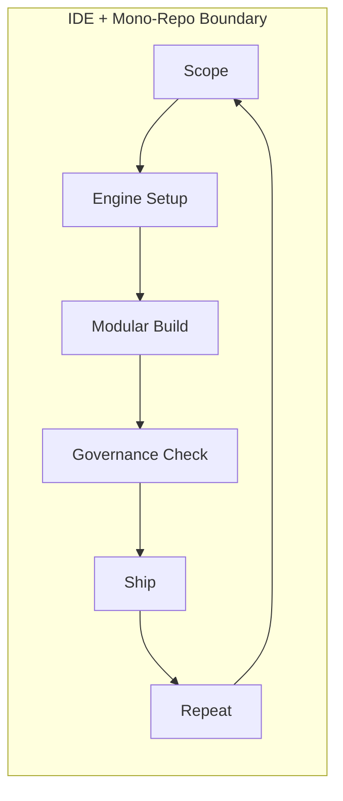

# AI Delivery Engine Workflow

## Overview – What this workflow is and what it solves

The **AI Delivery Engine (AIDE)** is a disciplined yet lightweight workflow for shipping AI-powered software **quickly _and_ responsibly**. It solves the classic dilemma of "move fast vs. stay compliant" by pairing two tightly-coupled cores **inside a single mono-repo and IDE workspace**:

| Core | Role |
|------|------|
| **Governance Core** | _Defines reality & destination_ — Scope Documents, Codebase Guide, Context Wrapper |
| **Assurance Core** | _Verifies reality meets definition_ — Human review, LLM diff, automated tests |

The constant handshake between these cores is the **Engine**. When Governance is satisfied, the build can ship. If not, Assurance feedback drives another iteration. The result is **traceable, tier-appropriate, auditable software** without excess ceremony.

---

## Core Steps – The Delivery Cycle

> Six repeatable stages power every version, from Tier-1 hobby apps to Tier-5 regulated systems.

1. **Scope**  
   • Draft or update a **Scope Document** (`docs/scopes/vX.Y.Z.md`) **directly inside this repository**.  
   • Capture goals, in/out scope, acceptance criteria, and delivery tier.  
   • _Governance sets the destination._

2. **Engine Setup**  
   • Select / confirm the **Delivery Tier** and load its **Context Wrapper** (`core/context_wrappers/`).  
   • Ensure the **Codebase Guide** (`core/codebase_guide.md`) mirrors current reality.  
   • Wire CI to run tier-required checks.  
   • _Governance establishes the rules of the road._

3. **Modular Build**  
   • Work in small, well-named branches targeting single user stories.  
   • Use AI prompts to scaffold code, tests, and docs _inside_ the boundaries set by the Context Wrapper.  
   • Remember you are the human — don't follow the LLM blindly; if something doesn't look right, question it.  
   • Keep the Codebase Guide up to date as modules land.  
   • After each section of the suggested Build Sequence is generated, use the Codebase Guide Update Template prompt (`prompts/update_codebase_guide.md`) to refresh the Codebase Guide accordingly.  
   • When encountering unfamiliar technologies or concepts, use the Learn As You Build prompt (`prompts/learn_as_you_build.md`) to gain genuine understanding rather than blindly implementing suggestions.  
   • Use your IDE's 'ASK' function: if a technology or approach doesn't make sense, ask the LLM to explain what it is and why it's needed.  
   • Scopes can be changed mid-build but must be managed carefully—refer to the upcoming scope management documentation for guidance.  
   • _Implementation moves forward under governance guardrails._

4. **Governance Check**  
   • Run **Assurance Core** checks: human code review, LLM compliance prompts, automated test suite.  
   • Compare Scope ↔ Codebase ↔ Wrapper for drift.  
   • Fix variances until **binary compliance** (pass/fail) is achieved.  
   • _Assurance confirms we built what we said, how we said._

5. **Ship**  
   • Merge to the main branch and release via tier-appropriate CI/CD.  
   • Produce release notes referencing the satisfied Scope Document.  
   • _Governance sign-off triggers shipment._

6. **Repeat**  
   • Start the next scoped cycle, upgrading tiers when risk or scale increases.  
   • _The Engine loops continuously, preventing drift over the life of the product._

---

## Delivery Tier Influence

Delivery Tiers scale **which** standards apply, never **how strictly** they are enforced.

| Tier | Typical Use | Standards Snapshot |
|------|-------------|--------------------|
| 1 – Hobby | Personal or internal prototype | Lint + smoke tests, basic docs |
| 3 – Beta | Team-sized public pilot | Full test suite, code-quality gates, architecture docs |
| 5 – Enterprise | Regulated or high-security | Provenance, mutation testing, SBOM, audit trails |

Moving up a tier means swapping to a stricter Context Wrapper and retro-fitting any gaps until **binary compliance** is restored.

For organizations implementing AIDE in regulated environments, see the [Example AI Coding Policy](example_ai_coding_policy.md) for a template that aligns with ISO27001 and Cyber Essentials standards.

---

## AI Prompt Usage

Prompts are **first-class tooling** in AIDE, used in three primary ways:

1. **Build Prompts** – Guide modular implementation (e.g., "generate API skeleton for US-03 using FastAPI & pydantic").  
2. **Learning Prompts** – Build genuine understanding of technologies and approaches (e.g., `prompts/learn_as_you_build.md`).
3. **Verification Prompts** – Run structured analysis (e.g., `prompts/check_context_wrapper_compliance.md`, `prompts/compare_scope_to_codebase.md`).

This approach ensures AI assistance enhances human expertise and remains aligned with Governance rather than bypassing it.

---

## Real-World Outcome

Following this workflow produces:

* **Scoped Releases** – Each version has an approved Scope Document with clear acceptance criteria.
* **Living Documentation** – The Codebase Guide always describes the current system.
* **Automated Proof** – CI artifacts demonstrate that code, docs, and tests satisfy the active Context Wrapper.
* **Audit Trail** – Every change is traceable back to scope intent and tier requirements.
* **Data Privacy by Default** – All work remains within the repo; telemetry is off unless explicitly enabled.

Teams gain speed from AI generation **without sacrificing trust, compliance, or maintainability**.

---

## Diagram

